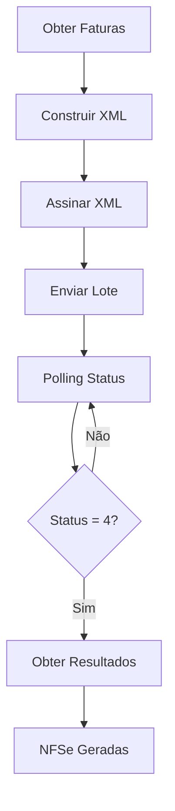

# Sistema NFSe Arapiraca

Sistema completo para emissão de Notas Fiscais de Serviços Eletrônicas (NFSe) para o município de Arapiraca/AL.

## 📋 Índice

- [Visão Geral](#visão-geral)
- [Instalação](#instalação)
- [Configuração](#configuração)
- [Uso Básico](#uso-básico)
- [Módulos do Sistema](#módulos-do-sistema)
- [Modos de Operação](#modos-de-operação)
- [Exemplos de Uso](#exemplos-de-uso)
- [Troubleshooting](#troubleshooting)
- [Estrutura do Projeto](#estrutura-do-projeto)

## 🎯 Visão Geral

Este sistema implementa a integração completa com o web service de NFSe da Prefeitura de Arapiraca, seguindo o padrão ABRASF. O sistema é capaz de:

- ✅ Gerar lotes RPS (Recibo Provisório de Serviços)
- ✅ Construir XML no padrão ABRASF
- ✅ Assinar digitalmente os documentos
- ✅ Enviar lotes para o web service
- ✅ Consultar status de processamento
- ✅ Obter NFSe geradas
- ✅ Modo de teste para desenvolvimento

## 🚀 Instalação

### Pré-requisitos

- Python 3.8+
- Certificado digital A1 (.pfx) para produção

### Passos de Instalação

1. **Clone ou baixe o projeto:**
```bash
cd c:\Users\erick\OneDrive\Documentos\SistemaNFS\nfse_arapiraca
```

2. **Crie e ative o ambiente virtual:**
```bash
python -m venv venv
venv\Scripts\activate
```

3. **Instale as dependências:**
```bash
pip install -r requirements.txt
```

## ⚙️ Configuração

### Arquivo de Configuração

Edite o arquivo `config.py` com suas informações:

```python
# Dados do Prestador
PRESTADOR_CNPJ = "12345678000195"  # Seu CNPJ
PRESTADOR_IM = "123456"            # Inscrição Municipal
CODIGO_MUNICIPIO = "2700102"       # Código de Arapiraca

# Certificado Digital
CERT_PATH = "certs/seu_certificado.pfx"
CERT_PASSWORD = "senha_do_certificado"

# Modos de Operação
TEST_MODE = False           # True para logs detalhados
SKIP_SIGNATURE = True       # True para pular assinatura (teste)
MOCK_WEBSERVICE = True      # True para simular web service
```

### Certificado Digital

Para produção, coloque seu certificado A1 na pasta `certs/`:
```
certs/
└── seu_certificado.pfx
```

## 📖 Uso Básico

### Processamento Automático

```python
from orchestrator import process_pending_invoices

# Processar todas as faturas pendentes
resultado = process_pending_invoices()

if resultado['sucesso']:
    print(f"✅ Processamento concluído!")
    print(f"Protocolo: {resultado['protocolo']}")
    print(f"NFSe geradas: {resultado['nfse_geradas']}")
else:
    print(f"❌ Erro: {resultado['erro']}")
```

### Consultas Individuais

```python
from soap_client import check_lote_status, get_lote_results

# Consultar status de um lote
status = check_lote_status("PROTOCOLO_123")
print(f"Status: {status['status_descricao']}")

# Obter resultados finais
resultados = get_lote_results("PROTOCOLO_123")
print(f"NFSe geradas: {len(resultados['nfse_geradas'])}")
```

## 🔧 Módulos do Sistema

### 1. `orchestrator.py` - Orquestrador Principal
Coordena todo o processo de emissão de NFSe:
- Obtém faturas pendentes
- Constrói XML do lote
- Assina digitalmente
- Envia para web service
- Monitora processamento
- Obtém resultados

### 2. `data_source.py` - Fonte de Dados
Gerencia os dados dos RPS:
- Obtém faturas para processamento
- Gera números de lote
- Formata dados no padrão esperado

### 3. `xml_builder.py` - Construtor de XML
Constrói XML no padrão ABRASF:
- Monta estrutura do lote RPS
- Valida dados obrigatórios
- Gera XML bem formado

### 4. `signer.py` - Assinatura Digital
Assina documentos XML:
- Carrega certificado A1
- Assina XML com padrão XMLDSig
- Suporte a modo de teste

### 5. `soap_client.py` - Cliente Web Service
Comunica com web service da prefeitura:
- Envia lotes RPS
- Consulta status
- Obtém NFSe geradas
- Trata erros e timeouts

### 6. `config.py` - Configurações
Centraliza todas as configurações do sistema.

## 🎮 Modos de Operação

### Modo Teste (Desenvolvimento)
```python
# config.py
TEST_MODE = False
SKIP_SIGNATURE = True
MOCK_WEBSERVICE = True
```
- Simula respostas do web service
- Pula assinatura digital
- Ideal para desenvolvimento

### Modo Homologação
```python
# config.py
TEST_MODE = False
SKIP_SIGNATURE = False
MOCK_WEBSERVICE = False
# URLs apontam para homologação
```
- Usa web service de homologação
- Requer certificado válido
- Testa integração real

### Modo Produção
```python
# config.py
TEST_MODE = False
SKIP_SIGNATURE = False
MOCK_WEBSERVICE = False
# URLs apontam para produção
```
- Ambiente de produção
- Gera NFSe reais
- Requer certificado válido

## 💡 Exemplos de Uso

### Exemplo 1: Processamento Completo
```python
#!/usr/bin/env python3
from orchestrator import process_pending_invoices
import logging

# Configurar logging
logging.basicConfig(level=logging.INFO)

def main():
    print("🚀 Iniciando processamento de NFSe...")
    
    resultado = process_pending_invoices()
    
    if resultado['sucesso']:
        print("✅ Sucesso!")
        print(f"   Protocolo: {resultado['protocolo']}")
        print(f"   Duração: {resultado['duracao']:.2f}s")
        print(f"   Etapas: {', '.join(resultado['etapas_concluidas'])}")
        print(f"   NFSe: {resultado['nfse_geradas']}")
    else:
        print("❌ Erro no processamento:")
        for erro in resultado['erros']:
            print(f"   - {erro}")

if __name__ == "__main__":
    main()
```

### Exemplo 2: Monitoramento de Lote
```python
from soap_client import check_lote_status
import time

def monitorar_lote(protocolo, max_tentativas=10):
    """Monitora um lote até conclusão"""
    
    for tentativa in range(1, max_tentativas + 1):
        print(f"Tentativa {tentativa}/{max_tentativas}")
        
        status = check_lote_status(protocolo)
        
        if not status['sucesso']:
            print(f"❌ Erro: {status['erro']}")
            break
            
        status_code = status['status']
        status_desc = status['status_descricao']
        
        print(f"Status: {status_code} - {status_desc}")
        
        if status_code == 4:  # Processado
            print("✅ Lote processado com sucesso!")
            break
        elif status_code == 3:  # Erro
            print("❌ Lote processado com erro!")
            break
        else:
            print("⏳ Aguardando processamento...")
            time.sleep(30)  # Aguarda 30 segundos

# Uso
monitorar_lote("PROTOCOLO_123")
```

### Exemplo 3: Integração com Sistema Próprio
```python
class NFSeIntegration:
    def __init__(self):
        self.logger = logging.getLogger(__name__)
    
    def processar_faturas_periodo(self, data_inicio, data_fim):
        """Processa faturas de um período específico"""
        
        # 1. Buscar faturas do seu sistema
        faturas = self.buscar_faturas_periodo(data_inicio, data_fim)
        
        if not faturas:
            self.logger.info("Nenhuma fatura encontrada para o período")
            return
        
        # 2. Processar com NFSe
        resultado = process_pending_invoices()
        
        # 3. Atualizar status no seu sistema
        if resultado['sucesso']:
            self.atualizar_status_faturas(faturas, 'PROCESSADO', resultado['protocolo'])
        else:
            self.atualizar_status_faturas(faturas, 'ERRO', None)
        
        return resultado
    
    def buscar_faturas_periodo(self, inicio, fim):
        # Implementar busca no seu banco de dados
        pass
    
    def atualizar_status_faturas(self, faturas, status, protocolo):
        # Implementar atualização no seu banco de dados
        pass
```

## 🔍 Troubleshooting

### Problemas Comuns

#### 1. Erro de Certificado
```
Erro: Certificado não encontrado: certs/seu_certificado.pfx
```
**Solução:**
- Verifique se o arquivo .pfx existe na pasta `certs/`
- Confirme se a senha está correta em `CERT_PASSWORD`
- Para teste, use `SKIP_SIGNATURE = True`

#### 2. Erro de Conexão SOAP
```
Erro: There is no default service defined
```
**Solução:**
- Verifique conectividade com internet
- Confirme URLs do web service em `config.py`
- Para teste, use `MOCK_WEBSERVICE = True`

#### 3. Dados Inválidos
```
Erro: Campo obrigatório não informado
```
**Solução:**
- Verifique dados em `data_source.py`
- Confirme CNPJ e Inscrição Municipal
- Valide estrutura dos dados RPS

#### 4. Timeout na Consulta
```
Erro: Timeout ao consultar status
```
**Solução:**
- Aguarde mais tempo entre consultas
- Verifique se o lote foi realmente enviado
- Consulte logs do web service

### Logs do Sistema

Os logs são salvos em `nfse_orchestrator.log`:

```bash
# Ver logs em tempo real
tail -f nfse_orchestrator.log

# Filtrar erros
grep "ERROR" nfse_orchestrator.log

# Ver últimas 50 linhas
tail -50 nfse_orchestrator.log
```

### Validação de Configuração

```python
def validar_configuracao():
    """Valida configuração antes de usar"""
    
    import config
    import os
    
    erros = []
    
    # Validar dados obrigatórios
    if not config.PRESTADOR_CNPJ:
        erros.append("PRESTADOR_CNPJ não configurado")
    
    if not config.PRESTADOR_IM:
        erros.append("PRESTADOR_IM não configurado")
    
    # Validar certificado (se não em modo teste)
    if not config.SKIP_SIGNATURE:
        if not os.path.exists(config.CERT_PATH):
            erros.append(f"Certificado não encontrado: {config.CERT_PATH}")
    
    if erros:
        print("❌ Erros de configuração:")
        for erro in erros:
            print(f"   - {erro}")
        return False
    
    print("✅ Configuração válida!")
    return True

# Usar antes de processar
if validar_configuracao():
    resultado = process_pending_invoices()
```

## 📁 Estrutura do Projeto

```
nfse_arapiraca/
├── 📄 README.md              # Esta documentação
├── 📄 requirements.txt       # Dependências Python
├── 📄 config.py             # Configurações do sistema
├── 📄 orchestrator.py       # Orquestrador principal
├── 📄 data_source.py        # Fonte de dados RPS
├── 📄 xml_builder.py        # Construtor de XML
├── 📄 signer.py             # Assinatura digital
├── 📄 soap_client.py        # Cliente web service
├── 📄 main.py               # Script principal
├── 📄 nfse_orchestrator.log # Logs do sistema
├── 📁 certs/                # Certificados digitais
├── 📁 venv/                 # Ambiente virtual Python
└── 📁 __pycache__/          # Cache Python
```

## 🔄 Fluxo de Processamento



## 📞 Suporte

Para dúvidas ou problemas:

1. **Verifique os logs** em `nfse_orchestrator.log`
2. **Consulte esta documentação**
3. **Teste em modo simulado** primeiro
4. **Valide configurações** antes de usar

---

**Sistema NFSe Arapiraca** - Versão 1.0  
Desenvolvido para integração com web service da Prefeitura de Arapiraca/AL# evolutech_nfse_arapiraca
# evolutech_nfse_arapiraca
